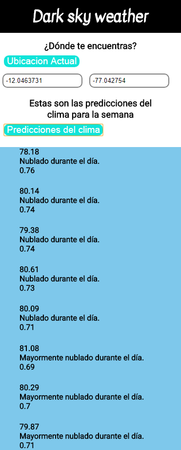

# WEATHER

## Objetivo:

+ Crear una página que pida la localización para obtener los datos clima del día y lugar actual. Al dar click en predicciones del clima, se mostrarán los datos de los próximos 7 días obtenidos desde el API de Dark Sky.

## Herramientas utilizadas:

+ HTML5.
+ CSS3.
+ API Dark Sky Weather.
+ Javascript.

Además fue implementado en el servidor.

## Flujo de la aplicación:

